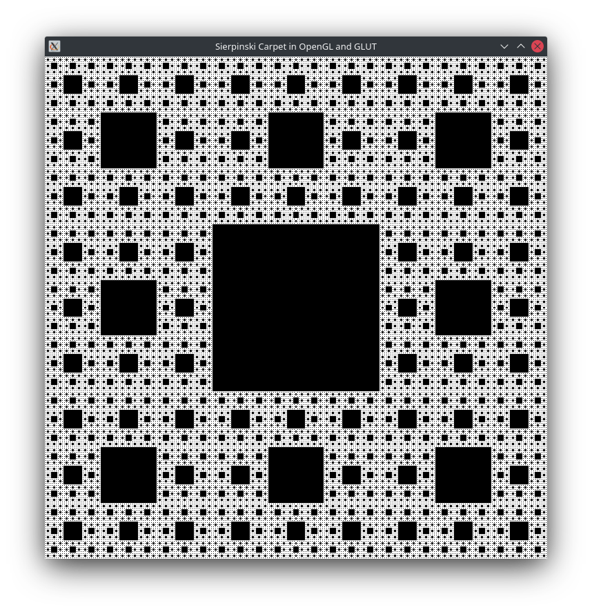
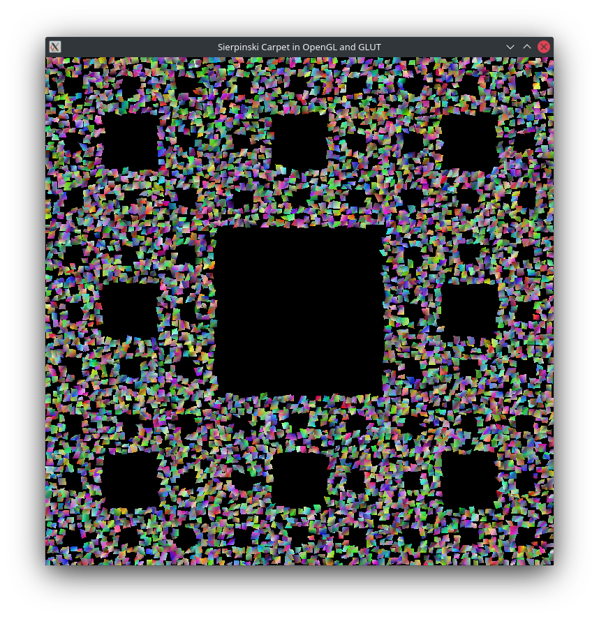

# Sierpinski Carpet in OpenGL

Sierpinski Carpet generation using OpenGL and GLUT library. Written in c++.

## Compiling:

To compile the source code execute the command:

```sh
make
```

or:

```sh
g++ src/main.cpp -lGL -lglut -o bin/main
```

## Usage:

To run the programm execute the command:

```sh
./bin/main
```

### Available flags

- `--size <size_in_px>` sets the carpet width and height. To generate the carpet properly the size_in_px number must be a power of 3. (Default value: 728)

- `--iterations <num_of_iterations>` sets the number of iterations ("the depth of the recursion tree"). (Default value: 6)

- `--color` sets the color of inner cubes to random values.

- `--deformation <deformation_amout>` randomly deforms the carpet. The deformation_amount must be a floating point number between 0.0 and 1.0. 0.0 means no deformation. 1.0 means that deformation can achieve a maximum value of one inner square. (Default value: 0.0)

- `--help` prints help text.

## Images

### Carpet generated by 6 iterations and width of 728 pixels.



Generated by executing the following command:

```sh
./bin/main --iterations 6 --width 728
```

### Carpet with random color and deformations:



Generated by executing the following command:

```sh
./bin/main --iterations 4 --deformation 0.3 --color
```
